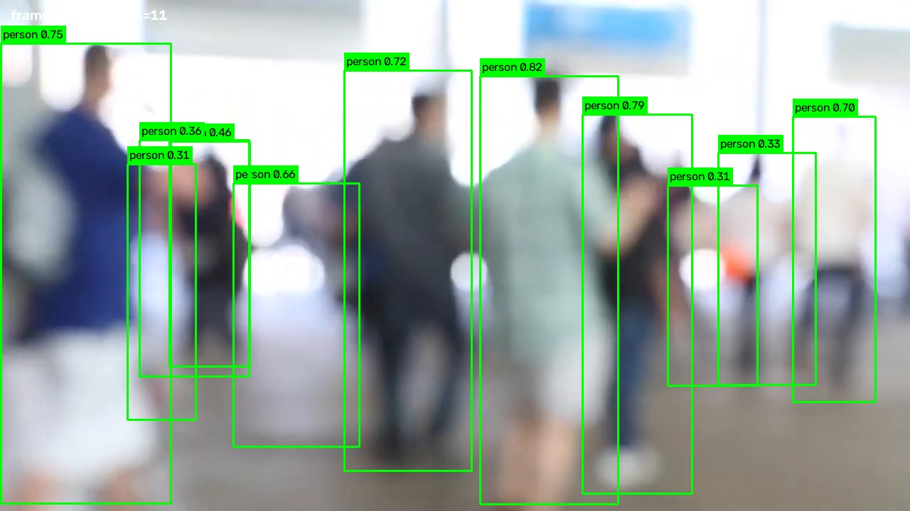
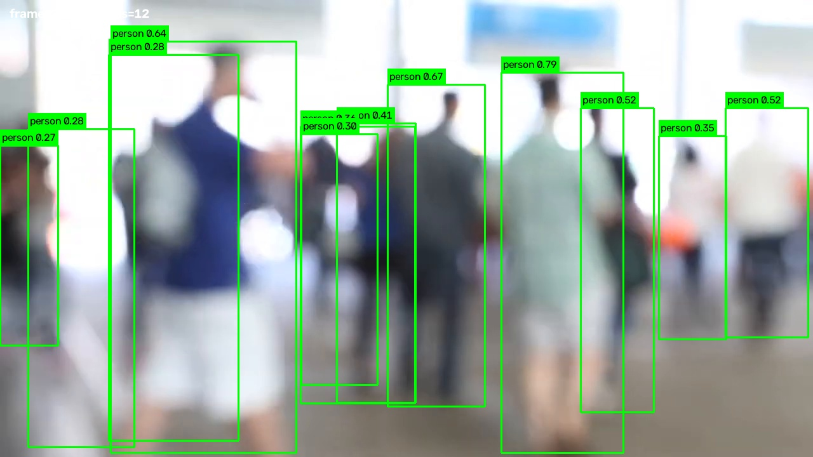
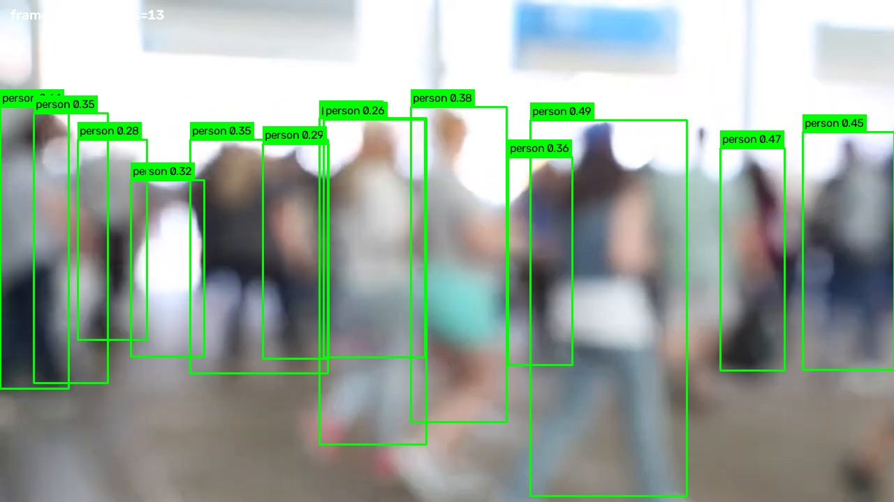

# YOLO Inference - HARPia

Inferência YOLO reproduzível para o projeto **HARPia**, com foco em percepção visual antes de qualquer integração com controle de voo.

[](https://github.com/Phantom-root-br/yolo-inference/actions/workflows/ci.yml)

## Visão geral

O repositório possui dois fluxos principais:

1. **imagem estática** com `inference.py`;
2. **detecção de pessoas em vídeo** com `scripts/detect_people.py`.

A POC de vídeo foi validada no ambiente HARPia usando **YOLO11n em CPU**, sem modificar ROS 2, PX4 ou Gazebo.

```text
vídeo
  |
  v
OpenCV VideoCapture
  |
  v
frame -> YOLO11n -> classe person
                    |
                    +-> bounding boxes + confiança
                    +-> métricas JSON
                    +-> frames de evidência
                    +-> vídeo anotado
```

## Status da POC

| Item | Resultado |
|---|---:|
| Modelo principal | YOLO11n |
| Resolução | 1280x720 |
| Frames processados | 1137 / 1137 |
| FPS da fonte | 29,970 |
| Tempo de processamento | 449,202 s |
| FPS efetivo de processamento | 2,531 |
| Tempo médio por frame | 395,077 ms |
| Inferência YOLO média | 354,935 ms/frame |
| Detecções acumuladas de `person` | 7044 |
| Confiança média | 0,5562 |

> `7044` representa bounding boxes acumuladas ao longo dos frames. Não são 7044 pessoas únicas; não há tracking ou reidentificação nesta POC.

## Relatórios para estudo e apresentação

Dois PDFs consolidam a entrega:

- [**Relatório Técnico - HARPia YOLO Person Detection POC**](docs/reports/Relatorio_Tecnico_HARPia_YOLO_POC.pdf) - contexto, arquitetura, metodologia, resultados, benchmark, limitações e roteiro de apresentação.
- [**Guia de Estudo do Código - HARPia YOLO**](docs/reports/Guia_Estudo_Codigo_HARPia_YOLO.pdf) - leitura orientada do código, funções-chave, fluxo de dados, bounding boxes, métricas, logs, H.264 e perguntas técnicas para defesa.

Índice dos materiais: [`docs/reports/README.md`](docs/reports/README.md).

## Por que YOLO11n?

YOLO11n e YOLO11s foram comparados nos mesmos primeiros 60 frames, com `imgsz=640`, `conf=0.25`, `device=cpu` e filtro da classe `person`.

| Métrica | YOLO11n | YOLO11s |
|---|---:|---:|
| FPS de processamento | 1,473 | 1,042 |
| Tempo médio/frame | 678,9 ms | 959,8 ms |
| Inferência YOLO | 568,9 ms | 862,5 ms |
| Detecções | 425 | 422 |
| Confiança média | 0,5533 | 0,5887 |
| Tamanho do peso | 5,35 MB | 18,42 MB |

No hardware atual, YOLO11s consumiu cerca de **1,41x mais tempo por frame** e é **3,44x maior**, sem aumento no total de detecções no trecho comparado. Por isso, **YOLO11n é o baseline recomendado**.

Detalhes: [`docs/results.md`](docs/results.md).

## Ambiente validado

- Intel Core i3-3217U @ 1.80 GHz;
- 2 núcleos físicos / 4 threads;
- sem GPU NVIDIA;
- CUDA desabilitado;
- Python 3.10.12;
- PyTorch CPU;
- Ultralytics 8.4.158;
- OpenCV 5.0.0;
- ambiente YOLO: `/root/yolo_venv`.

O detector desabilita NNPACK quando disponível para evitar warnings de backend não suportado nessa CPU antiga. Isso **não** desabilita a inferência em CPU e não tem relação com CUDA.

## Uso rápido no HARPia

```bash
cd /root/harpia_ws/src/yolo-inference
```

### 1. Baixar o vídeo reproduzível

```bash
./scripts/download_video.sh
```

A entrada é salva em `input/people_cc.mp4` e permanece fora do Git.

### 2. Smoke test de 60 frames

```bash
./scripts/run_video_poc.sh test
```

### 3. Execução completa

```bash
./scripts/run_video_poc.sh full
```

### 4. Regenerar apenas vídeo web + painel

Se a inferência completa já foi executada:

```bash
./scripts/run_video_poc.sh report
```

Esse modo **não executa YOLO novamente**. Ele reutiliza o MP4 anotado e as métricas existentes.

## Visual e logs

O runner grava logs timestampados em:

```text
logs/video_poc_<modo>_<timestamp>.log
```

Para acompanhar o log mais recente em outro terminal:

```bash
./scripts/watch_video_log.sh
```

Após `test`, `full` ou `report`, o painel fica em:

```text
output/video_report.html
```

Sirva o repositório localmente:

```bash
/root/yolo_venv/bin/python -m http.server 8000 --bind 0.0.0.0
```

Abra no navegador:

```text
http://localhost:8000/output/video_report.html
```

O painel reúne:

- vídeo anotado;
- bounding boxes e labels `person`;
- métricas da execução;
- benchmark YOLO11n x YOLO11s;
- frames de evidência;
- trecho final do log.

Mais detalhes: [`docs/OBSERVABILITY.md`](docs/OBSERVABILITY.md).

## Compatibilidade do vídeo no navegador

O detector grava o MP4 anotado com OpenCV usando `mp4v`. Como esse codec pode falhar em navegadores, o runner converte o resultado para:

```text
output/yolo11n_people_web.mp4
```

A conversão usa:

- H.264 / `libx264`;
- `yuv420p`;
- `+faststart`;
- `imageio-ffmpeg` dentro do ambiente Python.

As bounding boxes já estão desenhadas nos frames antes da conversão, portanto a transcodificação **preserva as detecções** e não roda YOLO novamente.

## Detector de vídeo

Execução direta, sem o runner:

```bash
/root/yolo_venv/bin/python scripts/detect_people.py \
  --input input/people_cc.mp4 \
  --output output/yolo11n_people.mp4 \
  --model yolo11n.pt \
  --imgsz 640 \
  --conf 0.25 \
  --device cpu \
  --metrics results/yolo11n_metrics.json \
  --examples 3 \
  --examples-dir results/examples
```

Argumentos principais:

```text
--input            vídeo de entrada
--output           vídeo anotado de saída
--model            peso YOLO; padrão yolo11n.pt
--imgsz            tamanho da entrada; padrão 640
--conf             confiança mínima; padrão 0.25
--device           dispositivo; padrão cpu
--max-frames       limita frames para smoke tests
--metrics          JSON de métricas
--examples         quantidade de frames representativos
--examples-dir     diretório dos frames de exemplo
--progress-every   frequência das mensagens de progresso
```

A classe `person` é encontrada programaticamente em `model.names`; o pipeline não depende de um número mágico espalhado no código.

## Inferência em imagem estática

```bash
python inference.py imagem.jpg \
  --model yolo11n.pt \
  --device cpu \
  --imgsz 640 \
  --conf 0.25 \
  --output resultado.jpg \
  --json-output resultado.json
```

Além de classe, confiança e bbox, esse fluxo calcula `cx`, `cy`, `ex` e `ey`, deixando explícito o erro do centro da detecção em relação ao centro da imagem.

No HARPia também existe:

```bash
./scripts/run_harpia.sh /root/harpia_ws/src/HARPia_YOLO_Export/camera_5m.jpg
```

Mais detalhes: [`docs/HARPIA.md`](docs/HARPIA.md).

## Evidências versionadas

A execução completa selecionou automaticamente três frames representativos:

| Frame 252 | Frame 269 | Frame 350 |
|---|---|---|
|  |  |  |

O critério prioriza mais pessoas detectadas e, em caso de empate, maior soma das confidências.

## Estrutura principal

```text
.
├── inference.py
├── visual_report.py
├── docs/
│   ├── ARCHITECTURE.md
│   ├── HARPIA.md
│   ├── OBSERVABILITY.md
│   ├── results.md
│   └── reports/
│       ├── README.md
│       ├── Relatorio_Tecnico_HARPia_YOLO_POC.pdf
│       └── Guia_Estudo_Codigo_HARPia_YOLO.pdf
├── input/
├── output/
├── results/
│   ├── comparison.csv
│   ├── video_metadata.json
│   ├── video_source.json
│   ├── yolo11n_metrics.json
│   ├── yolo11n_test60_metrics.json
│   ├── yolo11s_test60_metrics.json
│   └── examples/
├── scripts/
│   ├── detect_people.py
│   ├── download_video.sh
│   ├── run_video_poc.sh
│   ├── watch_video_log.sh
│   ├── video_report.py
│   ├── transcode_web_video.py
│   ├── setup.sh
│   └── run_harpia.sh
└── tests/
```

## O que não é versionado

O `.gitignore` mantém fora do repositório:

- pesos `*.pt`;
- vídeos de entrada e saída;
- painel HTML local;
- logs temporários;
- caches e ambientes virtuais.

Métricas, CSV, documentação, frames de evidência e relatórios de estudo permanecem versionados para auditoria e apresentação.

## Desenvolvimento e CI

```bash
python -m pip install -r requirements-dev.txt
ruff check .
pytest
```

O GitHub Actions executa verificações leves sem baixar pesos e sem rodar inferência pesada.

## Limitações

- hardware antigo e CPU-only;
- inferência offline no hardware testado;
- sem tracking de identidade;
- sem ground truth anotado para medir precision, recall ou mAP no vídeo;
- pesos COCO genéricos, sem fine-tuning específico para o HARPia;
- benchmark prático entre dois modelos, não benchmark científico abrangente;
- sem integração operacional com controle PX4 nesta etapa.

## Próximos passos

- [x] inferência em imagem estática;
- [x] detecção de pessoas em vídeo;
- [x] bounding boxes, métricas e evidências;
- [x] benchmark YOLO11n x YOLO11s;
- [x] logs e painel local;
- [x] vídeo H.264 compatível com navegador;
- [x] documentação técnica e guia de estudo do código;
- [ ] entrada contínua da câmera do HARPia;
- [ ] medir latência ponta a ponta da câmera;
- [ ] nó ROS 2 persistente;
- [ ] publicação de detecções e imagem de debug;
- [ ] dataset específico e ground truth;
- [ ] fine-tuning quando houver dados adequados;
- [ ] seleção de alvo;
- [ ] controle PX4 somente após validação suficiente da percepção.

A separação entre percepção e futura integração ROS 2 está documentada em [`docs/ARCHITECTURE.md`](docs/ARCHITECTURE.md).

## Licença

A licença do projeto ainda precisa ser definida pelos responsáveis antes de estabelecer os termos de redistribuição e reutilização.
